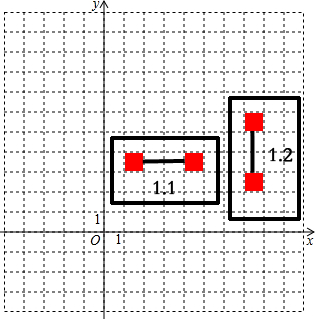

#连连看判断算法简述#

###总述###

我们把连连连看需要判断的情况按路径折点的数目和连线的特征大致分为四种

分别是：

* 直接连线的
* 带一个转折的
* 带两个转折并且折点位于两个方块之外的
* 带两个转折并且折点位于两个方块之间的

这样四种情况。

然而，每种情况都会分出其他的子情况，比如，第一中情况包活横着的和竖着的等等

**我们所需要做的，就是对所有可能的情况进行判断，确定被选中的两个方块是否可以消除**

####所有出现的情况####

下图将展示所有需要判断的情况：

* 第一种情况：也就是一条直线的情况，又可分出两种

	

* 第二种情况：

####判断的步骤####

下面的代码，是用来判断第二种情况的，也就是整个判断的基本步骤

为了助于理解，这里将代码分段写出来：

* 定义isMatched用于表示是否可以相连并消掉

	<pre><code>BOOL isMatched=YES;</code></pre>

* 然后将AB两个点进行转换，使其变成利于判断的标准情况

	<pre><code>
		blockA=[MIPositionConvert convertWithConversion:conversion Position:blockA inverse:NO];
		blockB=[MIPositionConvert convertWithConversion:conversion Position:blockB inverse:NO];
	</code></pre>

* 这里首先做的是检查AB两点是否符合这种情况的基本特征

	<pre><code>
    	if((blockA.x<blockB.x && blockA.y>blockB.y)||(blockA.x>blockB.x && blockA.y<blockB.y)){
        	//判断部分
        	//判断之后..
    	}else{
        	return nil;
    	}
    </code></pre>

* 接下来就是判断部分，先把方块A移到左上，然后再进行判断，如果路径经过点不是空白的，就让isMatched为NO（消不掉），然后结束判断。

	<pre><code>
        //让方块A在左上
        if(blockA.x>blockB.x && blockA.y<blockB.y){
            MIPosition *positionTemp=blockB;
            blockB=blockA;
            blockA=positionTemp;
        }
    	//向右
        for(int i=blockA.x+1;i<=blockB.x;i++){
            MIPosition *position=position=[MIPositionConvert convertWithConversion:conversion X:i Y:blockA.y inverse:YES];
            if([map blockAtX:position.x Y:position.y]!=0){
                isMatched=NO;
                break;
            }
        }
        //向下
        for(int i=blockA.y-1;i>blockB.y;i--){
            MIPosition *position=[MIPositionConvert convertWithConversion:conversion X:blockB.x Y:i inverse:YES];
            if([map blockAtX:position.x Y:position.y]!=0){
                isMatched=NO;
                break;
            }
        }
	</code></pre>
	
* 最后，如果可以消掉，就要输出路径
	<pre><code>
		if(isMatched==YES){
            NSMutableArray *routeVertexes=[NSMutableArray array];
  			//将转换过的点转换回来
            [routeVertexes addObject:blockA];
            [routeVertexes addObject:[MIPosition positionWithX:blockB.x Y:blockA.y]];
            [routeVertexes addObject:blockB];
            //创建路径
            routeVertexes=[MIPositionConvert convertWithConversion:conversion Positions:routeVertexes inverse:YES];
            //输出结果
            return [MIRoute routeWithRouteVertexes:routeVertexes];
        }else{
            return nil;
        }
	</code></pre>
	
这便是整个判断的全过程，这里以对第二种情况的判断为例，其他的判断也都是以类似的模式进行的。